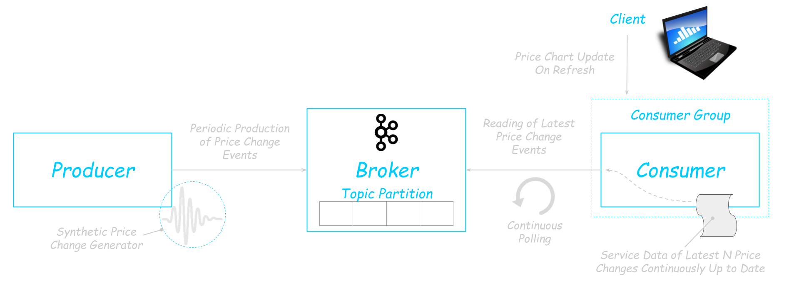
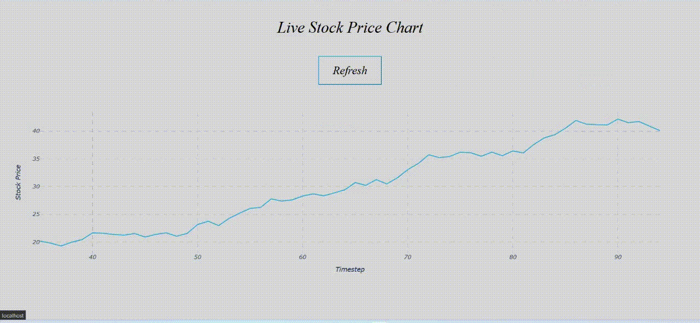

<h1 align="center">Kafka for an Event-driven Microservice Architecture</h1>

<p align="center">
    Kafka for an Event-driven Microservice-based Project to Produce (Synthetic) Stock Price Changes as Events and to Consume Such Messages in a Web Application for Rendering a Real-Time Stock Price History Chart
</p>


## The Project in a Picture:




## How to Build and Run the Project:

After installing Docker and Docker Compose, execute, in the root project directory:
```bash
docker compose up --detach
```
(Docker Version: 20.10.18 | Docker Compose Version: v2.12.2)


## A Video-Example:



You can access the consumer application interface at http://localhost:8000.

You can inspect producer and consumer logs by respectively runing:

```bash
docker compose logs producer
```

<details>
<summary>A Samples of the Producer Container's Logs</summary>

```
kafka-producer-1  | INFO:root:Event published ✓
kafka-producer-1  |     Event details: headers: None | key: b'mattia-stock-price' | latency: 1.552934 | offset: 0 | partition: 0 | timestamp: (1, 1672937092827) | topic: stock-prices | value: b'1'
kafka-producer-1  | INFO:root:Event published ✓
kafka-producer-1  |     Event details: headers: None | key: b'mattia-stock-price' | latency: 0.00998 | offset: 1 | partition: 0 | timestamp: (1, 1672937094983) | topic: stock-prices | value: b'0.3496084180408183'
kafka-producer-1  | INFO:root:Event published ✓
kafka-producer-1  |     Event details: headers: None | key: b'mattia-stock-price' | latency: 0.00726 | offset: 2 | partition: 0 | timestamp: (1, 1672937095594) | topic: stock-prices | value: b'1.540346349024266'
kafka-producer-1  | INFO:root:Event published ✓
kafka-producer-1  |     Event details: headers: None | key: b'mattia-stock-price' | latency: 0.006448 | offset: 3 | partition: 0 | timestamp: (1, 1672937096203) | topic: stock-prices | value: b'2.95458382763149'
kafka-producer-1  | INFO:root:Event published ✓
kafka-producer-1  |     Event details: headers: None | key: b'mattia-stock-price' | latency: 0.006385 | offset: 4 | partition: 0 | timestamp: (1, 1672937096811) | topic: stock-prices | value: b'3.063719732835274'
kafka-producer-1  | INFO:root:Event published ✓
kafka-producer-1  |     Event details: headers: None | key: b'mattia-stock-price' | latency: 0.005647 | offset: 5 | partition: 0 | timestamp: (1, 1672937097419) | topic: stock-prices | value: b'4.281951266695756'
kafka-producer-1  | INFO:root:Event published ✓
kafka-producer-1  |     Event details: headers: None | key: b'mattia-stock-price' | latency: 0.007608 | offset: 6 | partition: 0 | timestamp: (1, 1672937098026) | topic: stock-prices | value: b'3.996164511683388'
kafka-producer-1  | INFO:root:Event published ✓
kafka-producer-1  |     Event details: headers: None | key: b'mattia-stock-price' | latency: 0.007488 | offset: 7 | partition: 0 | timestamp: (1, 1672937098635) | topic: stock-prices | value: b'3.7307283111967244'
kafka-producer-1  | INFO:root:Event published ✓
kafka-producer-1  |     Event details: headers: None | key: b'mattia-stock-price' | latency: 0.005826 | offset: 8 | partition: 0 | timestamp: (1, 1672937099244) | topic: stock-prices | value: b'4.165709451702387'
kafka-producer-1  | INFO:root:Event published ✓
kafka-producer-1  |     Event details: headers: None | key: b'mattia-stock-price' | latency: 0.006039 | offset: 9 | partition: 0 | timestamp: (1, 1672937099851) | topic: stock-prices | value: b'4.726634442747579'
kafka-producer-1  | INFO:root:Event published ✓
kafka-producer-1  |     Event details: headers: None | key: b'mattia-stock-price' | latency: 0.004103 | offset: 10 | partition: 0 | timestamp: (1, 1672937100458) | topic: stock-prices | value: b'5.384804750395232'
kafka-producer-1  | INFO:root:Event published ✓
kafka-producer-1  |     Event details: headers: None | key: b'mattia-stock-price' | latency: 0.005176 | offset: 11 | partition: 0 | timestamp: (1, 1672937101064) | topic: stock-prices | value: b'6.079011078347191'
kafka-producer-1  | INFO:root:Event published ✓
kafka-producer-1  |     Event details: headers: None | key: b'mattia-stock-price' | latency: 0.006494 | offset: 12 | partition: 0 | timestamp: (1, 1672937101670) | topic: stock-prices | value: b'5.615852882514226'
kafka-producer-1  | INFO:root:Event published ✓
kafka-producer-1  |     Event details: headers: None | key: b'mattia-stock-price' | latency: 0.005713 | offset: 13 | partition: 0 | timestamp: (1, 1672937102278) | topic: stock-prices | value: b'4.833149028858861'
kafka-producer-1  | INFO:root:Event published ✓
kafka-producer-1  |     Event details: headers: None | key: b'mattia-stock-price' | latency: 0.005793 | offset: 14 | partition: 0 | timestamp: (1, 1672937102886) | topic: stock-prices | value: b'5.273386963660958'
kafka-producer-1  | INFO:root:Event published ✓
kafka-producer-1  |     Event details: headers: None | key: b'mattia-stock-price' | latency: 0.005984 | offset: 15 | partition: 0 | timestamp: (1, 1672937103493) | topic: stock-prices | value: b'5.764161056996162'
kafka-producer-1  | INFO:root:Event published ✓
kafka-producer-1  |     Event details: headers: None | key: b'mattia-stock-price' | latency: 0.005947 | offset: 16 | partition: 0 | timestamp: (1, 1672937104101) | topic: stock-prices | value: b'6.0631501150225455'
kafka-producer-1  | INFO:root:Event published ✓
kafka-producer-1  |     Event details: headers: None | key: b'mattia-stock-price' | latency: 0.005367 | offset: 17 | partition: 0 | timestamp: (1, 1672937104708) | topic: stock-prices | value: b'6.383755014357777'
kafka-producer-1  | INFO:root:Event published ✓
kafka-producer-1  |     Event details: headers: None | key: b'mattia-stock-price' | latency: 0.006406 | offset: 18 | partition: 0 | timestamp: (1, 1672937105315) | topic: stock-prices | value: b'7.107090155251835'
kafka-producer-1  | INFO:root:Event published ✓
kafka-producer-1  |     Event details: headers: None | key: b'mattia-stock-price' | latency: 0.005811 | offset: 19 | partition: 0 | timestamp: (1, 1672937105923) | topic: stock-prices | value: b'7.4096179789004095'
kafka-producer-1  | INFO:root:Event published ✓
kafka-producer-1  |     Event details: headers: None | key: b'mattia-stock-price' | latency: 0.005553 | offset: 20 | partition: 0 | timestamp: (1, 1672937106530) | topic: stock-prices | value: b'8.9295355151101'
```

</details>

```bash
docker compose logs consumer
```

<details>
<summary>A Samples of the Consumer Container's Logs</summary>

```
kafka-consumer-1  | Dash is running on http://0.0.0.0:8000/
kafka-consumer-1  |
kafka-consumer-1  |  * Serving Flask app 'application'
kafka-consumer-1  |  * Debug mode: off
kafka-consumer-1  | WARNING: This is a development server. Do not use it in a production deployment. Use a production WSGI server instead.
kafka-consumer-1  |  * Running on all addresses (0.0.0.0)
kafka-consumer-1  |  * Running on http://127.0.0.1:8000
kafka-consumer-1  |  * Running on http://172.26.0.4:8000
kafka-consumer-1  | Press CTRL+C to quit
kafka-consumer-1  | INFO:root:Partition offset(s) committed ✓
kafka-consumer-1  |     Details:
kafka-consumer-1  |     - offset 15 in partition 0 of topic 15
kafka-consumer-1  | INFO:root:Partition offset(s) committed ✓
kafka-consumer-1  |     Details:
kafka-consumer-1  |     - offset 16 in partition 0 of topic 16
kafka-consumer-1  | INFO:root:Partition offset(s) committed ✓
kafka-consumer-1  |     Details:
kafka-consumer-1  |     - offset 17 in partition 0 of topic 17
kafka-consumer-1  | INFO:root:Partition offset(s) committed ✓
kafka-consumer-1  |     Details:
kafka-consumer-1  |     - offset 18 in partition 0 of topic 18
kafka-consumer-1  | INFO:root:Partition offset(s) committed ✓
kafka-consumer-1  |     Details:
kafka-consumer-1  |     - offset 19 in partition 0 of topic 19
kafka-consumer-1  | INFO:root:Partition offset(s) committed ✓
kafka-consumer-1  |     Details:
kafka-consumer-1  |     - offset 20 in partition 0 of topic 20
```

</details>


## Simplifications:

- no fault tolerance (single broker, producer and consumer replicas, simplified producer and consumer)
- consumer cannot scale (no event fetching coordination in distributed application, as Kafka Streams API not employed, and in-memory data storage)
- at-most-once producer-to-broker delivery
- at-least-once broker-to-consumer delivery
